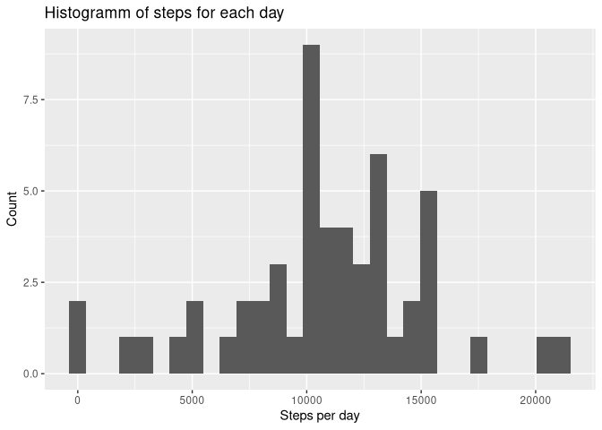
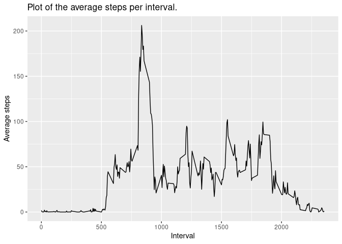
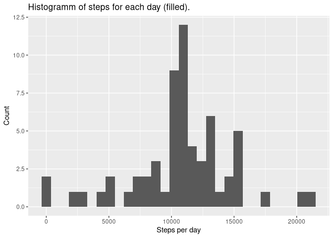
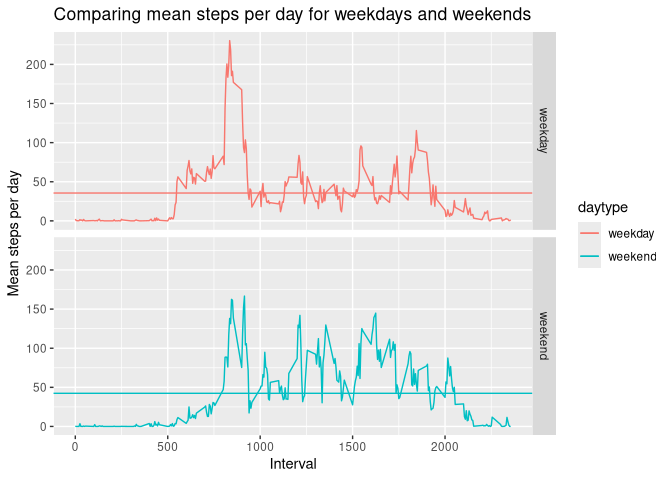

## Loading and preprocessing the data
Loading all used libraries

``` r
library(tidyr)
library(lubridate)
library(dplyr, warn.conflicts = FALSE)
library(ggplot2)
```

Loading the csv data and grouping it by date and interval

``` r
activityData <- read.csv("activity.csv", colClasses = c("double", "Date", "integer")) %>% 
  as_tibble %>% group_by(date, interval)
```


## What is mean total number of steps taken per day?

``` r
stepsPerDay <- activityData %>% group_by(date) %>% summarise(stepsperday = sum(steps))
ghist <- ggplot(stepsPerDay, aes(stepsperday))
ghist + geom_histogram() + labs(x = "Steps per day", y = "Count", title = "Histogramm of steps for each day")
```

```
## `stat_bin()` using `bins = 30`. Pick better value with `binwidth`.
```

```
## Warning: Removed 8 rows containing non-finite outside the scale range
## (`stat_bin()`).
```

<!-- -->

Mean of the total steps:

``` r
stepsPerDayMean <- mean(stepsPerDay$stepsperday, na.rm = TRUE)
stepsPerDayMean
```

```
## [1] 10766.19
```

Median of the total steps:

``` r
stepsPerDayMedian <- median(stepsPerDay$stepsperday, na.rm = TRUE)
stepsPerDayMedian
```

```
## [1] 10765
```

## What is the average daily activity pattern?
Make a time series plot (i.e.  type = "l") of the 5-minute interval (x-axis) and the average number of steps taken, averaged across all days (y-axis)

``` r
avgStepsPerInterval <- activityData %>% group_by(interval) %>% summarize(avgSteps = mean(steps, na.rm = T))
ginterval <- ggplot(avgStepsPerInterval, aes(interval, avgSteps))
ginterval + geom_line() + labs(x = "Interval", y = "Average steps", title = "Plot of the average steps per interval.")
```

<!-- -->

The 5-minute interval, on average across all the days in the dataset, with the maximum number of steps is:

``` r
avgStepsPerInterval[which.max(avgStepsPerInterval$avgSteps),]$interval
```

```
## [1] 835
```

## Imputing missing values
Using the function complete.cases i sum the total number of incomplete rows:

``` r
incompleteRows <- !complete.cases(activityData)
sum(incompleteRows)
```

```
## [1] 2304
```

To fill the missing values i decided to use the mean of the corresponding 5-minute interval.
This value is more fine grained than the mean of the day.
For this i create a vector for the whole 5-minute interval range filled with zeros
so i can access the mean values for each interval with the simple calculation: *index = (interval / 5) + 1*, i have to add 1 because in R indices are not 0-based.

``` r
intervalRange <- range(avgStepsPerInterval$interval)
intervallArray <- seq(from = 0, to = 0, length.out = (intervalRange[2]/5))
```
I then fill the intervals with the mean-values

``` r
for (idx in 1:dim(avgStepsPerInterval)[1]) 
{
  intervallArray[ (avgStepsPerInterval[idx,]$interval / 5) + 1 ] = avgStepsPerInterval[idx,]$avgSteps 
}
```
With my *intervallArray* vector i have fast access to the mean-values and save the new data in the new table *filledActivityData*.

``` r
filledActivityData <- activityData %>% mutate(steps = replace_na(steps, intervallArray[(interval/5) + 1]))
```

Like with the unfilled data i print the histogram of the step-counts.

``` r
filledStepsPerDay <- filledActivityData %>% group_by(date) %>% summarise(stepsperday = sum(steps))
ghist2 <- ggplot(filledStepsPerDay, aes(stepsperday))
ghist2 + geom_histogram() + labs(x = "Steps per day", y = "Count", title = "Histogramm of steps for each day (filled).")
```

```
## `stat_bin()` using `bins = 30`. Pick better value with `binwidth`.
```

<!-- -->

Mean of the total steps.

``` r
filledMean <- mean(filledStepsPerDay$stepsperday)
filledMean
```

```
## [1] 10766.19
```

There is no difference to the mean of the unfilled data, no surprise here because we used the 50%-quantile for filling:

``` r
filledMean - stepsPerDayMean
```

```
## [1] 0
```

Median of the total steps:

``` r
filledMedian <- median(filledStepsPerDay$stepsperday)
filledMedian
```

```
## [1] 10766.19
```
There is a slight difference of filled and unfilled median. Reason is there are more values that are being used to compute the median.

``` r
diffMedian <- filledMedian - stepsPerDayMedian
diffMedianPercent <- (diffMedian/ stepsPerDayMedian) * 100.0
diffMedian
```

```
## [1] 1.188679
```
Because there is no difference in the man and only 0.0110421% for the median there should be no impact on further analysis.

## Are there differences in activity patterns between weekdays and weekends?
To be able to group by day-type i add the new column *daytype*, the value is based on if the weekday is <= 5 (week starts on Monday).

``` r
filledActivityData$daytype <- if_else(wday(filledActivityData$date, week_start = 1) <=5, "weekday", "weekend")
```

Printing the means of step per days for weekday and weekend shows that there were more steps taken on the weekends.

``` r
stepsPerDayType <- filledActivityData %>% group_by(interval, daytype) %>% summarise(stepsperday = mean(steps))
```

```
## `summarise()` has grouped output by 'interval'. You can override using the
## `.groups` argument.
```

``` r
meanPerDayType = stepsPerDayType %>% group_by(daytype) %>% summarise(meanvalue = mean(stepsperday))
g <- ggplot(stepsPerDayType, aes(interval, stepsperday, color = daytype))
g + geom_line() + facet_grid(daytype ~ .) + geom_hline(aes(yintercept = meanvalue, color = daytype), meanPerDayType) +
  labs(x = "Interval", y = "Mean steps per day", 
       title = "Comparing mean steps per day for weekdays and weekends")
```

<!-- -->

``` r
meanPerDayType
```

```
## # A tibble: 2 × 2
##   daytype meanvalue
##   <chr>       <dbl>
## 1 weekday      35.6
## 2 weekend      42.4
```

